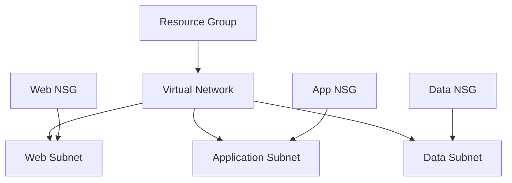

# Azure Terraform Network Foundation

A modular Terraform project for provisioning a reusable Azure network foundation using Infrastructure as Code (IaC), GitHub Actions, and Azure OpenID Connect (OIDC) authentication.

The repository implements a segmented multi-tier network architecture with reusable Terraform modules and automated infrastructure validation.

## Features

* Azure Resource Group
* Virtual Network
* Web Subnet
* Application Subnet
* Data Subnet
* Multi-tier Network Security Groups (NSGs)
* Tier-to-Tier Security Rules
* Subnet-to-NSG Associations
* GitHub Actions CI Pipeline
* Azure OIDC Authentication

## Architecture



The infrastructure follows a basic three-tier network segmentation model:

* The Web subnet accepts HTTPS traffic from the Internet.
* The Application subnet accepts traffic from the Web subnet.
* The Data subnet accepts traffic from the Application subnet.
* Network Security Groups enforce traffic boundaries between the individual tiers.

## Repository Structure

```text
modules/
├── resource-group
├── virtual-network
├── subnet
├── network-security-group
└── subnet-nsg-association
```

Infrastructure components are separated into reusable Terraform modules to keep the configuration maintainable and extensible.

## Local Usage

Initialize Terraform:

```powershell
terraform init
```

Validate the configuration:

```powershell
terraform validate
```

Review the planned infrastructure changes:

```powershell
terraform plan
```

Deploy the infrastructure when required:

```powershell
terraform apply
```

Remove deployed resources:

```powershell
terraform destroy
```

## CI/CD

GitHub Actions automatically performs Terraform validation for repository changes.

The pipeline includes:

* `terraform fmt`
* `terraform init`
* `terraform validate`
* `terraform plan`

Azure authentication is handled through OpenID Connect (OIDC), avoiding long-lived Azure credentials in GitHub.

## Technical Focus

* Terraform Modules
* Variables and Outputs
* Azure Virtual Networks
* Azure Subnets
* Network Security Groups
* Network Segmentation
* GitHub Actions
* Azure OIDC Authentication
* Pull Request Workflow
* Infrastructure as Code (IaC)

## Cost Awareness

The infrastructure is designed so that Terraform configuration and planned changes can be reviewed before resources are deployed.

Before applying infrastructure changes:

* Review the Terraform plan.
* Verify the resources that will be created.
* Monitor Azure resource costs.
* Remove temporary infrastructure when it is no longer required.

Running `terraform plan` does not provision Azure resources.

## Status

**Version:** v1.1

**Status:** Complete

This repository provides a reusable Azure networking foundation that can be extended with additional infrastructure components and larger Azure platform architectures.
