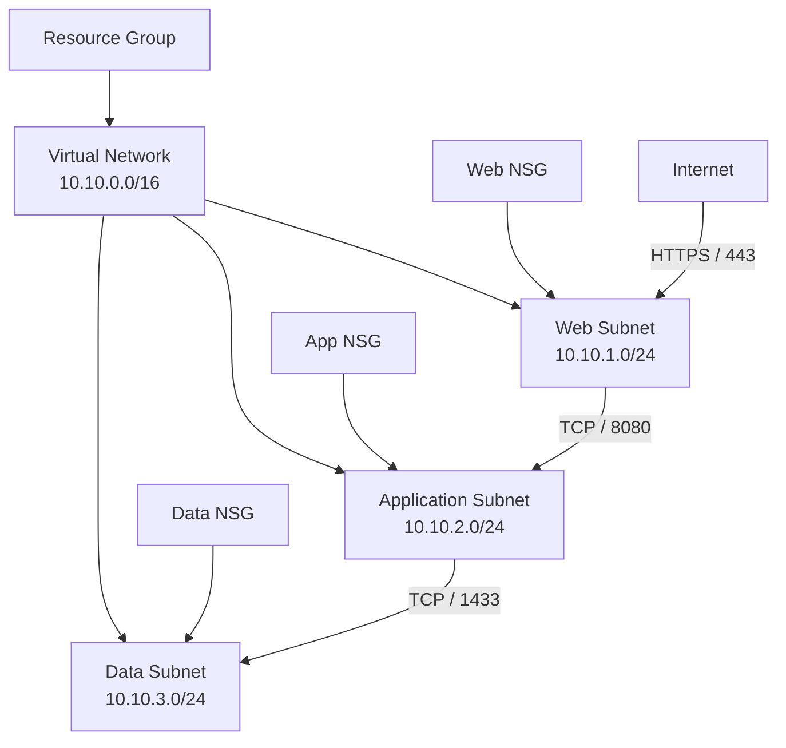

# Azure Three-Tier Network Foundation

A modular Terraform project for provisioning a segmented three-tier Azure network foundation using Infrastructure as Code (IaC), GitHub Actions, and Azure OpenID Connect (OIDC) authentication.

The repository demonstrates reusable Terraform modules, network segmentation, Network Security Groups (NSGs), and automated infrastructure validation.

## Architecture



The infrastructure follows a basic three-tier network segmentation model:

- The Web subnet accepts HTTPS traffic from the Internet on TCP port 443.
- The Application subnet accepts TCP port 8080 traffic from the Web subnet.
- The Data subnet accepts TCP port 1433 traffic from the Application subnet.
- Network Security Groups enforce traffic boundaries between the tiers.

## Features

- Azure Resource Group
- Azure Virtual Network
- Web, Application, and Data subnets
- Multi-tier Network Security Groups
- Tier-to-tier security rules
- Subnet-to-NSG associations
- Reusable Terraform modules
- Input validation
- Terraform outputs
- GitHub Actions CI pipeline
- Azure authentication through OIDC
- Example Terraform variable configuration

## Network Addressing

| Component | Address Space |
| --- | --- |
| Virtual Network | `10.10.0.0/16` |
| Web Subnet | `10.10.1.0/24` |
| Application Subnet | `10.10.2.0/24` |
| Data Subnet | `10.10.3.0/24` |

## Repository Structure

```text
.
├── modules/
│   ├── resource-group/
│   ├── virtual-network/
│   ├── subnet/
│   ├── network-security-group/
│   └── subnet-nsg-association/
├── main.tf
├── variables.tf
├── outputs.tf
├── providers.tf
├── versions.tf
├── terraform.tfvars.example
└── .github/
```

Infrastructure components are separated into reusable Terraform modules to keep the configuration maintainable and easy to extend.

## Configuration

An example variable configuration is provided in:

```text
terraform.tfvars.example
```

Create a local configuration from the example if custom values are required:

```powershell
Copy-Item terraform.tfvars.example terraform.tfvars
```

Real `.tfvars` files are excluded from version control through `.gitignore`.

## Local Usage

Initialize Terraform:

```powershell
terraform init
```

Format the configuration:

```powershell
terraform fmt -recursive
```

Validate the configuration:

```powershell
terraform validate
```

Review planned infrastructure changes:

```powershell
terraform plan
```

Deploy the infrastructure when required:

```powershell
terraform apply
```

Remove deployed resources:

```powershell
terraform destroy
```

## CI/CD

GitHub Actions performs Terraform validation for repository changes.

The workflow includes:

- `terraform fmt`
- `terraform init`
- `terraform validate`
- `terraform plan`

Azure authentication is handled through OpenID Connect (OIDC), avoiding long-lived Azure credentials in GitHub.

## Technical Focus

- Terraform modules
- Variables and outputs
- Azure Virtual Networks
- Azure subnet design
- Network Security Groups
- Three-tier network segmentation
- Terraform `for_each`
- GitHub Actions
- Azure OIDC authentication
- Pull request workflow
- Infrastructure as Code

## Cost Awareness

The project can be validated and planned without deploying Azure resources.

Before applying infrastructure changes:

- Review the Terraform plan.
- Verify the resources that will be created.
- Monitor Azure resource costs.
- Destroy temporary infrastructure when it is no longer required.

Running `terraform plan` does not provision Azure resources.

## Status

**Version:** v1.2
**Status:** Complete

The repository provides a compact Azure network foundation that can serve as a base for additional workloads and infrastructure components.